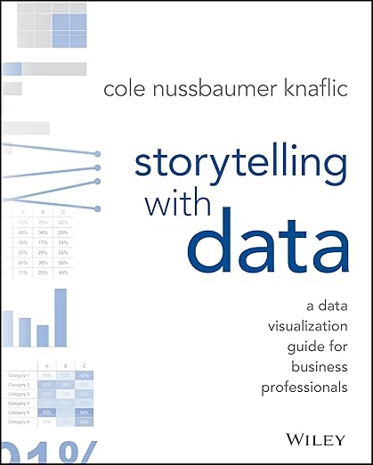

# CommunicatingWithData
Data and code repository for GSU Course MSA 8030 'Communicating with Data'

This material has been collected and developed for the course MSA 8030 in the [Master of Science in Analytics](https://robinson.gsu.edu/program/data-science-and-analytics-ms/) at the [J. Mack Robinson College of Business](http://robinson.gsu.edu) at [Georgia State University](http://gsu.edu).

## Topics and Schedule
The schedule below applies to Fall 2024. Please, refer to this page for any changes.

## Recommended Text Book

1. **story telling with data - a data visualization guide for data business professionals, 1st Edition**
    by Cole Nussbaumer Knaflic
    [Wiley](https://www.wiley.com/en-us/Storytelling+with+Data%3A+A+Data+Visualization+Guide+for+Business+Professionals-p-9781119002253/)

